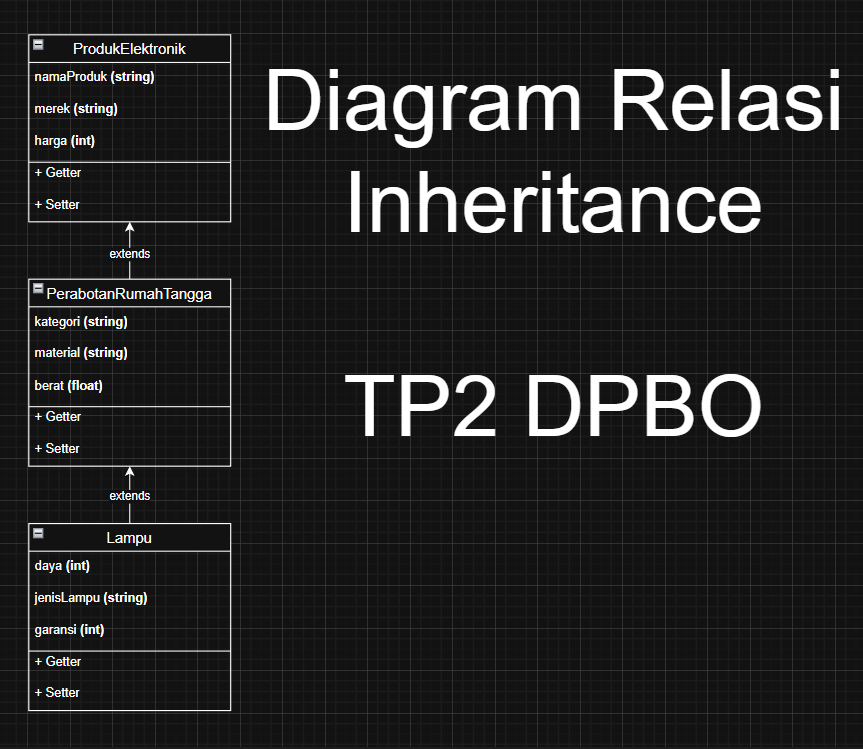

# 💻 TP2 DPBO - Imam Azizun Hakim - 2404420

## 🤝 Janji
"Saya Imam Azizun Hakim dengan NIM 2404420 mengerjakan Tugas Praktikum 2 dalam mata kuliah Desain Pemrograman Berorientasi Objek untuk keberkahan-Nya maka saya tidak akan melakukan kecurangan seperti yang telah di spesifikasikan."

## 🔀 Penjelasan Desain dan Kode Flow
- Menggunakan 3 class bernama **_ProdukElektronik_**, **_PerabotanRumahTangga_** dan **_Lampu_** yang masing-masingnya berisi 3 atribut

### Class ProdukElektronik
- Atribut **_ProdukElektronik_** :
<pre>
  ● nama       <strong>Nama Barang berupa String</strong>
  ● merek      <strong>Merek Barang berupa String</strong>
  ● harga      <strong>Harga Barang berupa Integer</strong>
  ● gambar     <strong>Gambar Barang (untuk PHP)</strong>
</pre>
- Method **_ProdukElektronik_** :
<pre>
  ● Constructor   <strong>Untuk membuat objek ProdukElektronik yang baru</strong>
  ● Getter        <strong>Mengambil nilai atribut</strong>
  ● Setter        <strong>Mengubah nilai atribut</strong>
</pre>

### Class PerabotanRumahTangga
- Atribut **_PerabotanRumahTangga_** :
<pre>
  ● kategori   <strong>Kategori Barang berupa String</strong>
  ● material   <strong>Material Barang berupa String</strong>
  ● berat      <strong>Berat/beban Barang berupa Float</strong>
</pre>
- Method **_PerabotanRumahTangga_** :
<pre>
  ● Constructor   <strong>Untuk membuat objek PerabotanRumahTangga yang baru</strong>
  ● Getter        <strong>Mengambil nilai atribut</strong>
  ● Setter        <strong>Mengubah nilai atribut</strong>
</pre>

### Class Lampu
- Atribut **_Lampu_** :
<pre>
  ● daya       <strong>Daya listrik Barang berupa Interger</strong>
  ● JenisLampu  <strong>Jenis/Kategori Lampu berupa String</strong>
  ● garansi      <strong>Waktu garansi Barang berupa Integer</strong>
</pre>
- Method **_Lampu_** :
<pre>
  ● Constructor   <strong>Untuk membuat objek KimElektro yang baru</strong>
  ● Getter        <strong>Mengambil nilai atribut</strong>
  ● Setter        <strong>Mengubah nilai atribut</strong>
</pre>

### Diagram
  
- Multi Level Inheritance : Lampu extends PerabotanRumahTangga extends ProdukElektronik
  - Kakek : ProdukElektronik
  - Ayah : PerabotanRumahTangga
  - Anak : ProdukElektronik
    
  * Karena fokus utama kita adalah toko elektronik, maka diurutan paling tinggi yaitu ada produk elektronik atau barang-barang elektronik apa saja yang ada. 
  * Kemudian dibagi menjadi kategori perabotan rumah tangga yang berarti produk elektronik yang memiliki peruntukan sebagai perabotan rumah tangga. 
  * Lalu dikerucutkan kembali ke Lampu jadi Produk elektronik dengan peruntukan perabotan rumah tangga berupa Lampu. 
  * Lampu akan memiliki atribut dari perabotan rumah tangga seperti kategori, material dan berat karena setiap Lampu pasti punya atribut ini. 
  * Lampu akan memiliki atribut dari produk elektronik seperti nama, merek dan harga karena setiap Lampu pasti punya atribut ini sebagai sebuah produk elektronik.
  
### Flow Program memiliki 3 option di menu
<pre>
  1. Tambah Data        <strong>Create        : Untuk menambah data baru</strong>
  2. Lihat/Tampil Data  <strong>Read          : Untuk membacaa dan menampilkan data</strong>
  3. Exit               <strong>Exit Program  : Untuk keluar dari program</strong>
</pre>

### Terdapat Error Handling Ketika
  - Memilih bukan option 1-3

### Kode dibuat dalam 4 Bahasa, yaitu :
  - C++ 💠
  - Java ☕
  - Python 🐍
  - Php 🐘
 
### Requirements
  - Menerima Input User ✅
  - 5 objek awal ✅
  - Tampilan data dalam 1 Tabel Dinamis ✅
  - File txt testcase ✅
    
## 📝 Dokumentasi
**Berikut adalah Dokumentasi berupa Screenshot saat program dijalankan di Terminal dan Web(Php)**

### C++
  
  
  
  

---

### Java
  
  
  
  

---

### Python
  
  
  
  

---

### Php
  
  
  
